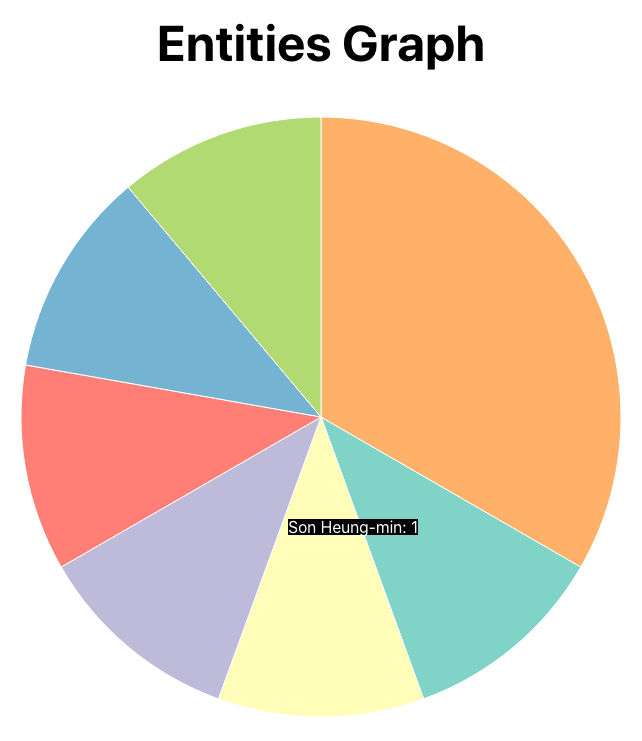

# IGUR (Instagram User Report)

[IGUR_backend readme에서 이어집니다](https://github.com/7inug1/IGUR_backend)

## 4. 데이터 그려주기 - d3.js



entities pie chart

entities는 wikipedia url을 가진 데이터를 추출해주면 재밌는 키워드가 많이 나올 것 같았습니다. frequency counter를 이용해 wikipedia_url을 가진 entity와 발생하는 횟수를 먼저 새로운 데이터셋으로 만들었습니다.

```jsx
entities?.forEach((entity) => {
  if (entity.metadata && entity.metadata["wikipedia_url"]) {
    const coreEntity = entity;
    const entityInfoObj = { count: 1 };

    if (entitiesCounter[coreEntity.name]) {
      entitiesCounter[coreEntity.name].count++;
    } else {
      Object.assign(entityInfoObj, { wikipedia_url: coreEntity.metadata["wikipedia_url"] });
      entitiesCounter[coreEntity.name] = entityInfoObj;
    };
  }
});
```

그리고 d3.js를 이용해 pie chart를 그려줬습니다. pie를 올릴 svg의 크기를 설정해주고, 위에서 가공해준 데이터를 알맞게 뿌려주고, 각 pie에 마우스를 올릴 때 어떤 식으로 툴팁을 보여줄지에 대한 코드를 작성했습니다.

```jsx
const pieData = d3.pie().value(d => d.count)(formattedData);
const arcGenerator = d3.arc().innerRadius(0).outerRadius(RADIUS);
const color = d3.scaleOrdinal().range(d3.schemeSet3);

const svg = d3.select(svgRef.current)
  .attr('width', WIDTH)
  .attr('height', HEIGHT)
  .append('g')
  .attr('transform', 'translate(300, 300)');

const tooldiv = d3.select('#chartArea')
  .append('div')
  .style('visibility', 'hidden')
  .style('position', 'absolute')
  .style('background-color', 'black')
  .style('color', 'white');

svg.append('g').selectAll('path')
  .data(pieData)
  .join('path')
  .attr('d', arcGenerator)
  .attr('fill', (d, i) => color(i))
  .attr('stroke', 'white')
  .on('mouseover', (event, d) => {
    tooldiv.style('visibility', 'visible')
      .text(`${d.data.name}: ${d.data.count}`)
  })
  .on('mousemove', (event, d) => {
    tooldiv.style('top', (event.pageY - 50) + 'px')
      .style('left', (event.pageX - 50) + 'px')
  })
  .on('mouseout', () => {
    tooldiv.style('visibility', 'hidden')
  });
```

# **작업 기간**

|  | 1주차 (22.06.27~22.07.03) | 2주차 (22.07.04~22.07.10) | 3주차 (22.07.11~22.07.017) |
| --- | --- | --- | --- |
| 작업 내용 | 아이디어 구체화, 칸반 작업 | 칸반 내용 진행 | 칸반 내용 진행 |

## 데이터 구조


# 어려웠던 점

## 1. 인스타그램에서 이상 행동을 감지하여 크롤링을 어렵게 한 점

결론부터 말하자면 해당 문제를 해결하기 위해 [https://www.picuki.com](https://www.picuki.com/) (인스타그램 컨텐츠를 호스팅하는 서드 파티 웹사이트)를 사용하였고, 여러 웹사이트가 봇 및 해커들의 공격을 막기 위해 마련한 선제 수단 (ex. Cloudflare)이 어떠한 역할을 하는지 알아볼 수 있는 기회가 되었습니다.

우선 Puppeteer를 통해 특정 인스타그램 사용자의 정보를 크롤링 하기 위해서 매번 새로운 브라우저로 실행이 되었기 때문에 인스타그램에 로그인을 해줘야 했습니다. 

코드 테스트를 위해 puppeteer를 통해 인스타그램에 10번 정도 로그인 하였습니다. 이후부터 인스타그램에서 로그인을 막기 시작했습니다. 아이디와 로그인 입력 속도가 너무 빨리 비정상 행동을 감지해서 그런가 싶어 입력 속도를 (사람이 입력하는 속도로) 늦추어봤지만 도움이 되지 않았습니다. 

이를 해결하기 위해 불가피하게 인스타그램 컨텐츠를 호스팅하는 서드 파티 웹사이트인 [https://www.picuki.com](https://www.picuki.com/)을 사용하게 되었습니다. 해당 웹사이트는 로그인을 하지 않아도 되고, 게시글 내용을 한 페이지 안에서 전부 확인할 수 있어 도움이 되었습니다.

 접속](readme-assets/Untitled%206.png)

Cloudflare 화면 - [picuki.com](http://picuki.com) 접속

하지만 picuki.com의 경우에 headless Chrome을 감지하여 Cloudflare 화면이 무한 반복이 되어 웹사이트를 접속할 수 없었습니다. Cloudflare는 전세계 여러 지역에 물리 서버를 두고 있어 웹사이트의 접속에 대한 latency를 줄이기 위한 고객들이 Cloudflare의 서버를 빌리며 CDN으로 이용한다는 걸 알게 되었고, 웹사이트에 접속하는 게 일반 유저인지 해커인지 판별하는 방화벽 역할을 한다고 알게 되었습니다.

봇으로 감지되지 않기 위해 [puppeteer-extra-plugin-stealth](https://www.npmjs.com/package/puppeteer-extra-plugin-stealth)라는 plugin을 이용해 Cloudflare의 감지를 피해갈 수 있었습니다. puppeteer-extra-plugin-stealth는 headless Chrome을 일반 사용자가 Chrome 브라우저를 사용하는 것처럼 구별를 없애며 봇 감지를 피할 수 있다고 합니다. 첫째로, headless Chrome은 navigator.webdriver 프로퍼티를 통해 자동화되어 브라우저를 띄우고 있다는 흔적을 남기는데 , **–disable-blink-features=AutomationControlled**라는 플래그를 사용하여 자동화 흔적을 없앤다고 합니다. 둘째로, 일반 Chrome에 존재하는 navigator.plugins 속성을 오버라이드하여 사람이 브라우저 동작을 하고 있는 것처럼 보이게 한다고 합니다.

출처: [https://datadome.co/bot-management-protection/detecting-headless-chrome-puppeteer-extra-plugin-stealth/](https://datadome.co/bot-management-protection/detecting-headless-chrome-puppeteer-extra-plugin-stealth/)

결론적으로 위와 같이 서드 파티 웹사이트 이용 및 puppeteer-extra-plugin-stealth 플러그인을 사용하여 크롤링에 대한 어려움을 해결할 수 있었습니다. 

## 2. img src의 CDN url을 크롤링 하여도 이미지를 띄울 수 없었던 점

처음에 인스타그램 사용자의 사진을 크롤링할 때 img src만 긁어오면 되는 걸로 생각 했습니다. 하지만 이미지 src가 잘 크롤링 되었음에도 불구하고, 이미지가 계속해서 alt값만을 보여줬습니다. 알아보니 인스타그램 이미지는 instagram.com이 origin일 때만 이미지를 표시하였습니다. 

여러 방안을 찾던 도중 예전에 CORS 제한을 우회하는 방법이 떠올랐습니다. CORS 문제는 브라우저 단에서 발생하는 메세지이기 때문에 서버 쪽에서 프록시 삼아 리소스를 요청하면 우회할 수 있다는 점이었습니다. 결론적으로 백엔드에서 CDN url을 fetch하여 이미지를 ArrayBuffer 형식으로 받아올 수 있었습니다.

이후 이미지 저장 및 처리 방식에 대해 고민하였습니다. 처음에는 이미지를 프론트 단으로 보내주기 위해 Base64로 변환해줬습니다. 하지만 Base64로 변환할 시에 33~37%의 오버헤드를 만들어 낸다는 걸 알게 되었습니다. 1 byte는 8 bits (2^8)로 총 256개의 정보를 나타낼 수 있습니다. 하지만 Base64는 한 byte에 64개의 ASCII 코드(대문자, 소문자, 숫자)를 이용하며 1 byte에 64 (2^6)개의 정보를 나타냅니다. 따라서 1 byte당 2 bits의 손실이 일어납니다.

예를 들면 24 bits의 정보를 보내기 위해 원래는 3 byte면 충분합니다. 1 byte에 8 bits가 들어가기에 3 byte가 필요합니다. 하지만 Base64는 한 byte에 6 bits 밖에 안들어가므로 총 4 byte가 필요합니다. 따라서 base 64로 변환하면 33.333…%만큼의 추가 공간을 필요로 합니다. 나머지 4%는 line break를 삽입하는 데에 추가된다고 합니다.

아무튼 이를 해결하기 위해 AWS S3를 사용하게 되었습니다. 이미지를 저장해보니 한 파일이 kb 단위 정도밖에 소모하지 않았고, img src를 즉시 확인할 수 있다는 장점이 있어 좋았습니다. 

## 3. Elastic Beanstalk에 배포한 백엔드 충돌 및 CORS 문제


POST 요청시 발생한 CORS 문제


배포된 백엔드에서 POST 요청 받을 시 browser process를 열 수 없다는 에러 발생

제작한 서비스에서 GET 요청에 대한 처리는 잘 되었지만, POST 요청을 날릴 시에 계속해서 브라우저에서 CORS 문제를 나타냈습니다. Node에서 CORS 라이브러리를 깔아 미들웨어를 사용중이었지만 설정이 잘못 되어 그런가 싶어 코드를 수정해봤지만 해결이 되지 않았습니다.

결국 배포한 서버에서 문제가 발생한다는 걸 알게 되었습니다. Elastic Beanstalk에 배포한 백엔드에서 여러 문제를 해결하고 마지막으로 `eb logs`를 통해 `Error: Failed to launch the browser process!` 라는 에러를 확인할 수 있었습니다. 해결하기 위해 curl을 통해 크롬을 설치해주는 config 파일을 .ebextensions 폴더 안에 넣어주며 재배포 시에 Chrome을 설치하게 하며 위의 문제를 해결하였습니다.

# **프로젝트를 마친 소감**

## 미래를 좀 더 잘 예측하고, 작업을 좀 더 잘 쪼개고 싶습니다.

프로젝트를 시작하기 전, 스택 선정 및 실현 가능성을 열심히 검증했던 것 같습니다. 내가 사용하려는 라이브러리가 내 작업 환경에서 잘 돌아가는지 테스트도 해보고, 테스트해볼 수 없다면 실현 가능한지 블로그 글 및 유튜브 영상을 열람하며 미래에 실현해낼 수 있는지 봤습니다. 불상사가 발생하는 것만큼 우울한 일도 없을 것 같았습니다.

하지만 처음 걸어보는 길이라 칸반을 잘게 잘 작성했다고 생각했음에도 계획처럼 잘 흘러가진 못했던 것 같습니다. 중간에 리팩토링을 하다가 추가로 시간이 소요되고, 작업이 할당된 시간보다 시간을 더 잡아먹기도 하고, 에러 없이 진행될 것만 같았던 작업에 되려 발목을 잡히곤 했습니다. 여차저차 해서 해결했지만 앞으론 좀 더 예측을 잘 하고 싶었습니다.

분명 다음 번에도 새로운 어려움에 맞닥뜨리긴 할 것입니다. 하지만 이번에 한 것처럼 새로운 기술을 써보고, 새로운 아이디어를 구현해내며 내가 어떠한 기술을 사용하는 데에 어느 정도의 시간이 걸리는지, 어떠한 어려움을 느끼는지 알게 되며 좀 더 예측 가능한 자신을 발견할 수 있을 거라 생각합니다.

그럼 하루에 어떠한 작업을 해낼 수 있는지 좀 더 잘 가늠할 수 있을 것이고, 계획대로 진행할 수 있는 칸반을 작성할 수 있을 것 같습니다. 정진해야겠습니다.